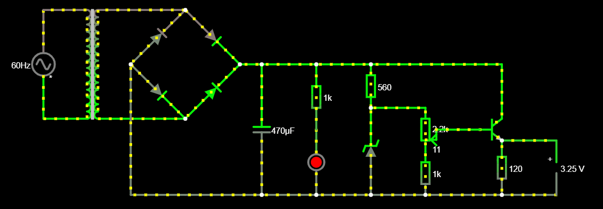
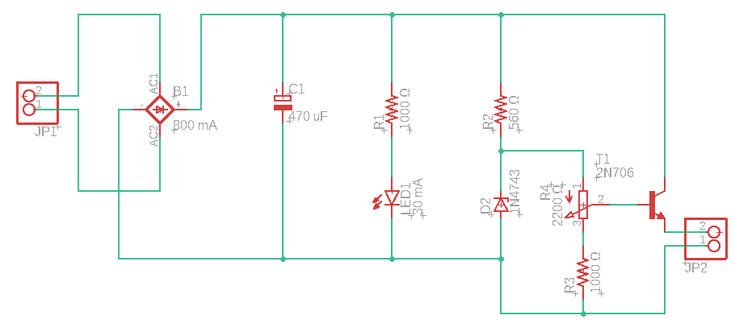
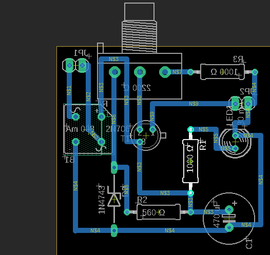

## PROJETO FONTE DE TENSÃO ELÉTRICA

Trabalho desenvolvido para a disciplina de Eletrônica para Computação; curso regular de graduação em Bacharelado em Ciências de Computação — ICMC-USP. São responsáveis pelo seu desenvolvimento: João Lucas Rodrigues Constantino e Gabriel Zanotim Manhani. O projeto consiste na produção de uma fonte de tensão elétrica, cujo valor absoluto varia entre, aproximadamente, 3.25 e 12.25V; ela opera com uma fonte de corrente alternada com frequência de 60.0Hz e tensão máxima igual a 127.0V.

### Arquivos de simulação pelo Falstad:

O circuito pode ser acessado por meio do link *http://tinyurl.com/y85s4ls2*; caso esse não funcione, a aplicação do *Falstad*, em navegador de *internet*, utiliza um código textual para salvar e carregar seus circuitos. No caso desse projeto, tal código pode ser encontrado [aqui](falstad-code.txt). Para replicar o circuito, uma das alternativas é copiar, para a área de transferência, todo o texto contido nesse arquivo; acessar o sítio *https://www.falstad.com/circuit/*; procurar por *Arquivo* no canto superior esquerdo; ir até *Importar de Arquivo Texto...*; copiar o conteúdo para a caixa originada e, enfim, selecionar *OK*.

### Componentes eletrônicos utilizados

O resistor de 120.0Ω e o voltímetro são meramente ilustrativos, servindo somente aos propósitos de simulação e de análise, logo, não integram o circuito final. Ademais, o LED e o resistor de 1.0kΩ a ele associado são componentes opcionais.

Nome do componente | Especificações | Preço estimado |
--- | --- | --- |
Transformador | Razão 1:5 ou 24.0V; 200.0mA | R$23.99 |
Ponte retificadora | 800.0mA | R$0,82 |
Capacitor eletrolítico | 470.0µF; 30.0V | R$0,90 |
Resistor (LED) | 1.0kΩ | R$0,12 |
Resistor (diodo zener) | 560.0Ω | R$0,15 |
Resistor (potenciômetro) | 1.0kΩ | R$0,12 |
Diodo emissor de luz (LED) | 30.0mA; 30.0V | R$0,20 |
Diodo zener | 30.0mA; 0.5W; z=13.0V | R$0,60 |
Potenciômetro | 2.2kΩ; 10.0V | R$2,20 |
Transistor NPN | 30.0mA; 30.0V | R$0,24 |

### Arquivos esquemáticos: circuito isolado e placa de circuito impresso

Os arquivos esquemáticos do *Eagle* são de extensões exclusivas à sua interpretação e, portanto, somente podem ser acessadas por meio de uma versão compatível desse programa. A saber, o sítio digital oficial desse *software* se encontra em *https://www.autodesk.com/products/eagle/*. Acima, está uma imagem da captura do resultado final do esquema do circuito, cujo arquivo correspondente, de extensão *.sch*, pode ser obtido [aqui](eagle-schematic-file.sch). Abaixo, há uma imagem do esquema da placa de circuito impresso, que representa as dimensões e disposições finais dos componentes e dos fios em uma placa desse tipo, cujo arquivo correspondente, de extensão *.brd*, é obtível por meio deste *[link](eagle-schematic-file.brd)*.

### Análise da funcionalidade e das especificações dos componentes

Um vídeo explicativo está disponível, e pode ser acessado por meio do *link* *https://youtu.be/DKq6uI3zoWM*. Como já afirmado, o circuito opera com uma fonte de corrente alternada, cujas especificações são uma frequência de 60.0Hz e um módulo máximo de tensão elétrica igual a 127.0V, todavia, caso um transformador de voltagem dupla seja implementado, tal fonte pode passar a receber um módulo máximo de 220.0V.

O **transformador** reduz a oscilação de tensão elétrica, originalmente estimada entre 127.0V e -127.0V, para um intervalo entre 24.0V e -24.0V, o que permite a utilização de componentes menos robustos no restante do circuito, os quais são relativamente mais baratos e dissipam menor quantia energética quando em operação. Esse componente não integra a placa de circuito impresso, pois ocorre como adereço externo a ela, que se conecta diretamente ao cabeçalho de entrada. Portanto, a entrada de fato dessa placa se torna a entrada do transformador.

A **ponte retificadora**, ou ponte de diodos, limita o intervalo de oscilação da tensão elétrica para 0 a 24.0V ao impedir o tráfego de retorno da corrente elétrica, isto é, impede o sentido oposto de navegação dessa ao longo do circuito. A corrente elétrica máxima que passa por esse componente apresenta valor de, aproximadamente, 720.0mA, o que torna seguro utilizar um modelo em que a resistência máxima à corrente elétrica seja de 800.0mA.

O **capacitor eletrolítico** transforma a corrente alternada em corrente contínua, além de reduzir e atenuar a variação de tensão elétrica. Isso ocorre devido à sua alternância de estados entre um armazém de carga e uma fonte de alimentação alternativa para o restante do circuito. Uma capacitância de 220.0µF serve aos propósitos desse projeto, porém possui estabilidade ligeiramente menor do que os utilizados 470.0µF, além de que este garante uma dissipação menor de energia durante a carga.

O **LED**, isto é, diodo emissor de luz, indica visualmente quando a fonte está ou não em operação. O resistor de 1.0kΩ a ele associado promove a viabilidade da utilização de um diodo que aguente a passagem de até 30.0mA de corrente elétrica através de si.

O **diodo zener**, com voltagem terminal de 13.0V, impede que a corrente elétrica o ultrapasse caso sua tensão elétrica associada supere tal voltagem. Possui, como função,  filtrar a tensão que acessará a base do transistor NPN a seguir. O resistor de 560.0Ω associado a esse diodo torna seguro utilizar um modelo que suporte um módulo máximo de corrente elétrica igual a 30.0mA. Por ser submetido, constantemente, a cerca de -15.0mA e -13.0V, é suficiente que resista a uma potência elétrica máxima de 0.5W.

O **potenciômetro** teve suas especificações devidamente adequadas à tensão elétrica de saída do circuito. Com 11.0Ω, essa assume o valor aproximado de 3.25V e, com 2.2kΩ, o valor aproximado de 12.25V. O resistor de 1.0kΩ que vem a seguir garante que o potenciômetro seja sempre alimentado corretamente com carga elétrica.

O **transistor NPN** indica o componente final desse circuito, e se responsabiliza pela última redução de oscilação de ambas, corrente e tensão elétricas de saída. A corrente elétrica que surge por sua base possui módulo aproximado de 270.0µA, o que é transformado, pelo transistor, em cerca de 27.0mA em sua saída. Por seu coletor ser submetido, constantemente, a uma corrente elétrica de, aproximadamente, 27.0mA, é suficiente que o modelo de NPN implementado suporte a um máximo de 30.0mA. Ademais, impede que a resistência do circuito em carga, que é conectado ao cabeçalho de saída, modifique o comportamento do restante do circuito.
