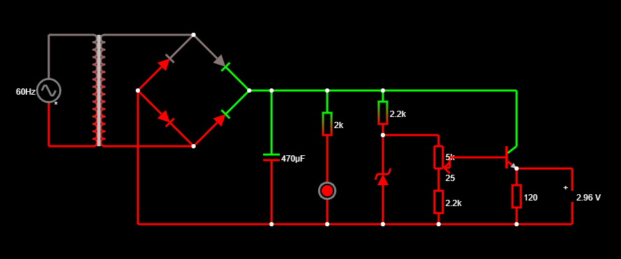

## PROJETO FONTE DE TENSÃO

  Trabalho desenvolvido para a disciplina de Eletrônica para Computação; curso regular de graduação em Bacharelado em Ciências de Computação — ICMC-USP. São responsáveis pelo seu desenvolvimento: João Lucas Rodrigues Constantino e Gabriel Zanotim Manhani. O projeto consiste na produção de uma fonte de tensão, cujo valor absoluto varia entre, aproximadamente, 3.2 e 12.2V.

### Arquivos gerados pelo Falstad:

O *software* Falstad utiliza um código textual para salvar e carregar seus circuitos. No caso desse projeto, tal código pode ser encontrado [aqui](falstad-code.txt). Para replicar o circuito, uma das alternativas é fazer o *download* deste arquivo; acessar o sítio *https://www.falstad.com/circuit/*, procurar por "Arquivo" no canto superior direito e, então, por *Abrir Arquivo...* e selecionar o arquivo baixado.

### Componentes eletrônicos utilizados

O resistor de 120.0Ω e o voltímetro são meramente ilustrativos, servindo somente aos propósitos de simulação e de análise, logo, não integram o circuito final. Ademais, o LED e o resistor de 1.0kΩ a ele associado são componentes opcionais.

Nome do componente | Especificações | Preço estimado |
--- | --- | --- |
Resistor (LED) | 1kΩ | R$??.?? |
Resistor (zener) | 560Ω | R$??.?? |
Resistor (potenciômetro) | 1kΩ | R$??.?? |
Transformador | Razão 1 : 0.2; 24V | R$??.?? |
Ponte retificadora | 800mA | R$??.?? |
Diodo emissor de luz (LED) | 30mA; 30V | R$??.?? |
Diodo zener | 30mA; 0.5W | R$??.?? |
Potenciômetro | 2.2kΩ 10V | R$??.?? |
Transistor NPN | 30mA; 30V | R$??.?? |

