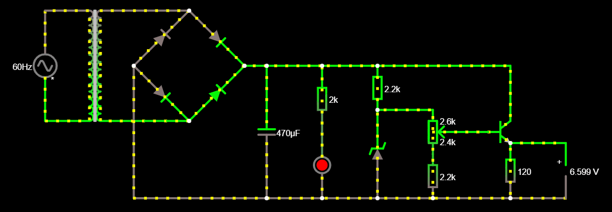

## PROJETO FONTE DE TENSÃO

Trabalho desenvolvido para a disciplina de Eletrônica para Computação; curso regular de graduação em Bacharelado em Ciências de Computação — ICMC-USP. São responsáveis pelo seu desenvolvimento: João Lucas Rodrigues Constantino e Gabriel Zanotim Manhani. O projeto consiste na produção de uma fonte de tensão elétrica, cujo valor absoluto varia entre, aproximadamente, 3.25 e 12.25V; ela opera com uma fonte de corrente alternada com frequência de 60.0Hz e tensão máxima igual a 127.0V.

### Arquivos de simulação pelo Falstad:

O circuito pode ser acessado por meio do link *http://tinyurl.com/y85s4ls2*; caso esse não funcione, a aplicação do Falstad, em navegador de *internet*, utiliza um código textual para salvar e carregar seus circuitos. No caso desse projeto, tal código pode ser encontrado [aqui](falstad-code.txt). Para replicar o circuito, uma das alternativas é copiar, para a área de transferência, todo o texto contido nesse arquivo; acessar o sítio *https://www.falstad.com/circuit/*; procurar por "Arquivo" no canto superior esquerdo; ir até *Importar de Arquivo Texto...*; copiar o conteúdo para a caixa originada e selecionar *OK*.

### Componentes eletrônicos utilizados

O resistor de 120.0Ω e o voltímetro são meramente ilustrativos, servindo somente aos propósitos de simulação e de análise, logo, não integram o circuito final. Ademais, o LED e o resistor de 1.0kΩ a ele associado são componentes opcionais.

Nome do componente | Especificações | Preço estimado |
--- | --- | --- |
Transformador | Razão 1:5 ou 24.0V | R$??.?? |
Ponte retificadora | 800.0mA | R$??.?? |
Capacitor eletrolítico | 470.0µF; 30.0V | R$??.?? |
Resistor (LED) | 1.0kΩ | R$??.?? |
Resistor (diodo zener) | 560.0Ω | R$??.?? |
Resistor (potenciômetro) | 1.0kΩ | R$??.?? |
Diodo emissor de luz (LED) | 30.0mA; 30.0V | R$??.?? |
Diodo zener | 30.0mA; 0.5W | R$??.?? |
Potenciômetro | 2.2kΩ; 10.0V | R$??.?? |
Transistor NPN | 30.0mA; 30.0V | R$??.?? |

### Arquivos esquemáticos: circuito isolado e placa de circuito impresso

*Pendente...*

### Apresentação

*Pendente...*
